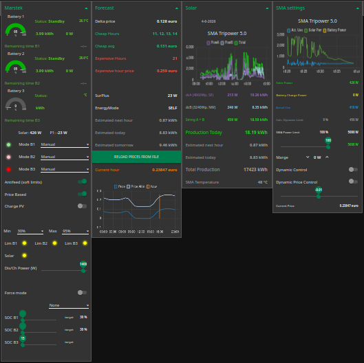
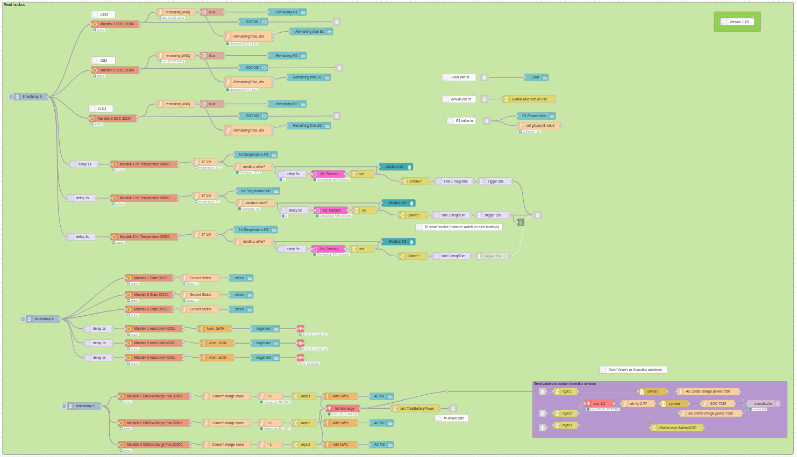
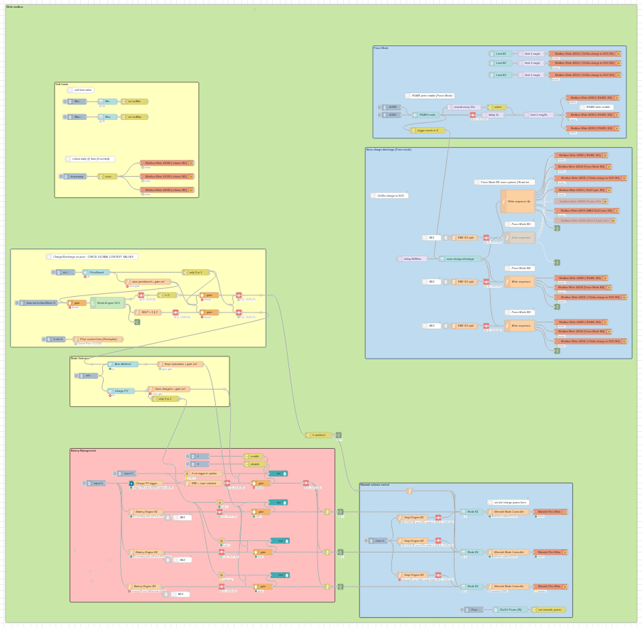
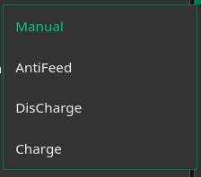
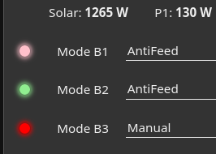
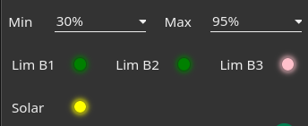
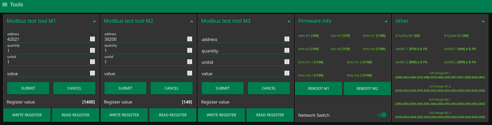

# Marstek Venus A Controller

Node-RED dashboard and Modbus control flow for fully local control of the Marstek Venus A battery system.

Tested with Marstek Venus A firmware up to version 149.

## 🔧 Features:
* Local battery control (no cloud dependency)
* Support for up to 3 Venus batteries
* Charge / Discharge / PV charging modes
* AntiFeed mode
* Dynamic electricity price control
* Day-ahead price analysis
* Temperature monitoring
* Schedule-based battery control
* Force mode control
* Direct Modbus register access
* Battery diagnostics and tooling
* Optional SMA Tripower integration (dynamic export limiting and   power control)
* Node-RED Dashboard UI

## Why this project?
Unlike many Modbus implementations that continuously write individual control registers, this project uses the Marstek internal schedule registers (43100–43104) to control battery behaviour.\
\
Benefits:
* Faster communication
* More reliable operation
* Simultaneous switching of multiple batteries
* No need to manually enable/disable RS485 mode
* Reduced dependency on firmware-specific behaviour
From version 0.1.7 onwards, schedule control is the recommended and default control method.

## Dashboard
Node-red script with UI to control the Marstek venus A (Tested up to firmware 149).
All without digging deep into marstek app to toggle the options.

## **The UI has 4 modes:**
***1. Antifeed (soft limits):*** using the Marstek own antifeed routine which keeps the P1 at zero (zero feedback, NOM) and keep the SOC within min and max set values.

***2. Price based mode:*** Using enever (zonneplan) day ahead prices looking for the cheap and expensive hours. Default is 4 cheapest hours to charge and 1 hour for the expensive hours to discharge max power and save some capacity for antifeed mode. Other hours are standby or antifeed mode.

***3. Charge PV:*** Charge the batteries whenever there is enough sun. Charge only without any feedback to the grid.

***4. Force mode:*** Control the batteries with the special registers where rs485 must be enabled.

\
\
Due to a discharge-related firmware issue, version 0.1.7 introduced a new control method based on the internal Marstek schedule registers (43100–43104). This method has proven to be more reliable across firmware versions and is now the recommended control approach. These registers are written in one smart command thru the "Marstek Mode controller" node.
\
Marstek simple fast schedule write sequence:

\
\
Dis/Charge Power setting can be set in the UI. The power can be set from 100W to 1500W in case it doesn't discharge try 1400W to avoid the fw bug.

> [!IMPORTANT]
> **Firmware Update Workaround (Discharge Issue, not needed from v0.1.7):**
> If discharging at 1500W via Modbus does not start, create a 24-hour discharge schedule set to 1500W in the official Marstek app, but leave the schedule **Disabled** (do not turn it on). This forces the firmware to keep the necessary registers open, allowing this Node-RED script to control the battery correctly. Check also the Battery-tooling flow there is an option to write to the max discharge register and you can automate it by enableling the inject set node.

## Related Projects

### SMA Active Power Control

Optional active PV power limiting and dynamic export control:

https://github.com/hansvanlin/SMA-Tripower-5.0---Active-Power-Control

## ▶️ Quick start
Requirements\
•Raspberry pi or other small pc \
•Optional domoticz or HomeAssistant installed\
•Node-red\
•node: node-red-contrib-modbus\
•Imported flows\
•Local network connection\
•Battery with P1 meter

## 🏗️ How to Install:

1. Install Node-RED
   https://nodered.org/docs/getting-started/

2. Open the Node-RED workspace
   http://localhost:1880

3. Install the missing nodes
   Not every node is included by default in Node-RED.
   The flow makes use of the "node-red-contrib-modbus" nodes.
   Adapt the marstek Ip number to your "your Ip number" with port ":502"

4. Import the flow files

   * Import the Zonneplan JSON file
   * Import the Marstek JSON file
   * Import the Battery tooling JSON file

5. Deploy the flows

6. Configure the Modbus nodes

   * Set the correct IP address
   * Use port `502`

7. Open the dashboard UI
   http://localhost:1880/ui

## 💡 **Write Schedule Method:**
Marstek Mode Controller Schedule Registers
\
The Mode Controller creates and activates a schedule by writing the following Modbus registers.

|Register|Value|Description|
|:-----|:-----|:---------------------------------|
|43100| 127| Active days bitmask (Monday-Sunday)|
|43101| 0000| Start time (HHMM)|
|43102| 2359| End time (HHMM)|
|43103| Mode dependent| Power or control value|
|43104| 0 / 1| Schedule enable (0 = disabled, 1 = enabled)|

|Day|Bitmask |(Register 43100)|
|:--|:---|:----------------------|
|Bit| Value| Day|
0| 1| Monday|
1| 2| Tuesday|
2| 4| Wednesday|
3| 8| Thursday|
4| 16| Friday|
5| 32| Saturday|
6| 64| Sunday|

|Example:|    |
|:---|:---------|
|Value| Active Days|
|127| Monday-Sunday|
|31| Monday-Friday|
|96| Saturday-Sunday|

|Mode|Values| (Register 43103)|
|:--|:---|:----------------------|
|Input Mode| Function| Register Value|
|0| Disabled| 64036|
|1| AntiFeed| 65535|
|2| Discharge| Power value (100-1500 W)|
|3| Charge| 65536 - Power value|

|Examples:|     |              |
|:--|:---|:----------------------|
|Mode| Power| Register 43103|
|AntiFeed| N/A| 65535|
|Discharge| 800 W| 800|
|Charge| 800 W| 64736|
|Disabled| N/A| 64036|

|Write Sequence:|
|:----------------------|
|the controller writes the registers in the following order:|
|1. Disable schedule ("43104 = 0")|
|2. Set active days ("43100 = 127")|
|3. Set start time ("43101 = 0000")|
|4. Set end time ("43102 = 2359")|
|5. Set mode/power value ("43103")|
|6. Enable schedule ("43104 = 1")|

## **Force Mode**

It's also possible to use the more common method via Force mode.

## ℹ️ **Rationale: Control Methods**

### Schedule Control (Recommended)

Uses the internal schedule registers:

- 43100 Day Mask
- 43101 Start Time
- 43102 End Time
- 43103 Power/Mode
- 43104 Enable

Advantages:
- Stable
- Works on multiple firmware versions
- Supports local automation

### Force Mode

Uses direct control registers:

- 42000 RS485 Enable
- 42011 Target SOC
- 42021 Force Mode / Discharge Power
- 42022 Charge Power

Advantages:
- Direct battery control
- Target SOC support

Notes:
- Behaviour may differ between firmware versions.
- Some firmware versions show inconsistent discharge behaviour at higher power levels.

## ℹ️ Modbus Registers used

| Register | Access | Description |
|:-----------|:--------|:-------------|
| 30006 | R | Charge / Discharge Power |
| 32104 | R | Battery SOC |
| 35000 | R | Internal Temperature |
| 35100 | R | Battery State |
| 42000 | W | RS485 Enable / Disable |
| 42011 | W | Target SOC |
| 42021 | W | Force Mode / Discharge Power |
| 42022 | W | Charge Power |
| 43100 | W | Schedule Day Bitmask |
| 43101 | W | Schedule Start Time |
| 43102 | W | Schedule End Time |
| 43103 | W | Schedule Mode / Power |
| 43104 | W | Schedule Enable |
| 44002 | W | Max Charge Power |
| 44003 | W | Max Discharge Power |

## **Some ScreenShots:**

### **Flow for reading all the data from the modbus registers**

### **Flow for processing and controlling the batteries**

### **Modbus configuration**
Set IP adress and port number. (double click on the node).

### **Read sequence in one call**
eg: read the 13 contiguous cell voltages registers in one poll.

### **Price Based Mode ON** result:

Charge or buy during cheap hours and sell for eg 1hour at expensive hour;

\
Orange is energy used from grid.

### Marstek app graph:

### **Dynamic price control**
Battery state in charging during cheap hours:

### Pulldown menu items:

### Added Modbus " still alive " and scheduled auto reset/reboot function:

### Modbus Leds:

Red: communication error\
Green: communication ok\
Pink: communication ok, data not changed\
Light green: communication ok, data has changed

### Added status Leds:

Red: Disabled\
Pink: Enabled\
Green: Value within limits or Solar high enough to charge\
Yellow: Idle or Solar not high enough.

### Force Mode:
First switch on Force Mode\
Select in the pull down menu one of the options eg:discharge\
Then use the slider to which level it should discharge eg: 20% (For charge use 80-100%)

## 🔋**Battery tooling:**

Have access to single modbus registers read or write. And compare per battery.\
Read firmware version also bms version from stacked batteries, number of cycles, Soc in 0.1% accuracy per battery module\
Reboot the battery\
Check the cell voltages

> [!WARNING]
> Start with low charge and discharge power limits and verify correct operation before increasing power.
>
> Always configure the maximum power limits according to your installation (e.g. 800 W or 1500 W) in both:
> - The Slider node
> - The Marstek Controller node
>
> Use this project at your own risk.

